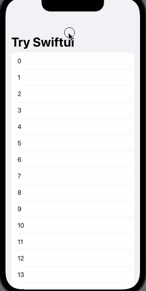
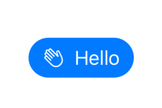
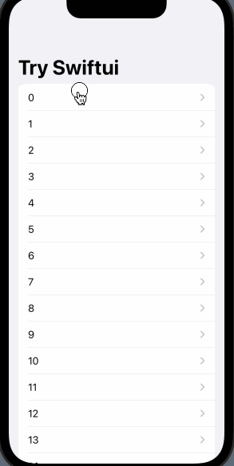
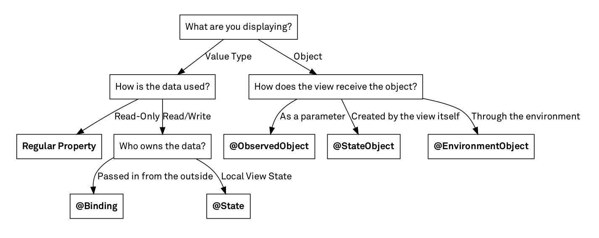

# Introduction to SwiftUI


---

# SwiftUI

> SwiftUI helps you build great-looking apps across all Apple platforms with the power of Swift — and as little code as possible
> https://developer.apple.com/xcode/swiftui/

---

# SwiftUI

+ SwiftUI is the most exciting news since Apple announce Swift in 2014.
+ SwiftUI lets you ignore Interface Builder (IB) and storyboards without having to write detailed step-by-step instructions for layout out your UI.
+ It's take less code than UIKit, so it's easy to understand, editing and debug
+ Declarative: "what it should be on certain state", the mutated state will be reflected automaticallly in the UI
+ SwiftUI doesn't replace UIKit, you can use both in the same app. The SwiftUI APIs are consistent across platforms, so it will be eaiser to develop on multiple (Apple) platforms using the same source code on each.
+ SwiftUI is not: "write once, run anywhere", more like "learn once, write anywhere (on the Apple platforms)

---

# SwiftUI

SwiftUI is all about Value type and Protocol
+ light-weight as `View` are value type
+ no memory leak and reference cycle
+ no more `self`, unless using reference type
+ cheap vs expensive
+ value type vs reference type
+ no inheritance, conforms to certain traits instead
+ no worry about view's life cycle, SwiftUI provides custom life cycles for view structs

---

# Availability

iOS 13.0+
macOS 10.15+
Mac Catalyst 13.0+
tvOS 13.0+
watchOS 6.0+

---

# Delcarative syntax


SwiftUI uses a **declarative** syntax, so you can **simply state what your user interface should do**.

```swift
import SwiftUI

struct ContentView: View {
    @State private var query: String = ""

    var body: some View {
        VStack(alignment: .leading) {
            TextField("name...", text: $query)
            Text("Hello: " + query)
                .foregroundColor(.secondary)
        }
        .padding()
    }
}
```

---

### A label

+ UIKit
```swift
let label = UILabel()
label.text = "Hello!"
return label
```

+ SwiftUI
```swift
Text("Hello")
```

---

### A list of items



+ UIKit
```swift
let tableView = UITableView()
...
tableView.delegate = self
tableView.datasource = self
...
tableView.reloadData()
...
numberOfRows...
...
cellForRow(at indexPath:...)
```

+ SwiftUI
```swift
List(items, id: \.self) { item in
    Text(item.title)
}
```

---

### A button



```swift
struct ContentView: View {
    @State private var buttonTap: Bool = false

    var body: some View {
        Button(action: {
            buttonTap.toggle()
        }, label: {
            Label("Hello", systemImage: "hand.wave")
        })
        .buttonStyle(.borderedProminent)
        .buttonBorderShape(.capsule)
    }
}s
```

---

# App

> A type that represents the structure and behavior of an app.
> https://developer.apple.com/documentation/swiftui/app

Create an app by declaring a structure that confirms to the `App` protocol.

---

# App

```swift
@main
struct MyApp: App {
    @Environment(\.scenePhase) private var scenePhase

    var body: some Scene {
        WindowGroup {
            SomeView()
        }
        .onChange(of: scenePhase) { newScenePhase in
            if newScenePhase == .background {
                // app is now in background
            }
        }
    }
}
```

---

+ `@main`: annotate the to indicate that `MyApp` struct conforms to the `App` protocol and provides the entry point of the app. Provides a default implementation of the `main()` method that the system calls to launch the app.
+ `Scene`: life cycle of the app 

Read more about `Scene` protocol: https://developer.apple.com/documentation/swiftui/scene

---

# View
> "A type that represents part of your app’s user interface and provides modifiers that you use to configure views."
> https://developer.apple.com/documentation/swiftui/view

Declaration
```swift
protocol View
```

---

# View
+ `View` protocol provides a blueprint for functionality.
+ The `View` procotol's main requirement is that comforming types must define a `body` computed property:
```swift
struct SomeView: View {
    var body: some View { ... }
}
```
+ SwiftUI reads the value of this propery any time it needs to update the view.
+ The `View` protocol's secondary requirements is that confirming types must indicate an `associated type` for the `body` property.

---

# View
`some View`

"You don't make an explicit declaration. Instead, you declare the body property as an `opaque type`, using the `some View` syntax, to indicate only that the body's type conforms to `view`. The exact type depends on the `body`'s content, which varies as you edit the body during development. Swift inferes the exact type automatically".

---

this is wrong:
```swift
var body: some Text {} // WRONG: return concrete `Text` type
```
with this you need to returns explicit `Text` view.

as with`some View`:
```swift
var body: some View {
    VStack {
        Button("A button")
        Text("Hello")
    }
}
```

Views that take multiple input child views, like the stack in the example above, typically do so using a closure marked with the `ViewBuilder` attribute. This enables a multiple-statement closure that doesn’t require additional syntax at the call site. You only need to list the input views.

---

# View Modifiers


Use view modifier to customze the appearance and behavior of `View`s.

```swift
Text("Hello")
    .frame(width: 100)
    .foregroundColor(.green)
```

Configure child views

```swift
VStack {
    Text("Hi")
    Text("Hello")
        .font(.largeTitle) // font for this view only
    Text("World")
    }
.font(.body) // apply body font for whole VStack
```

---

# Navigation in SwiftUI
## NavigationView

```swift
NavgationView {
    NavigationLink(
        destination: MyOtherView()
    ) {
        MyView()
    )
}
```

## NavigationLink
```swift
NavigationLink(
    destination: MyOtherView(),
    label: { Text("Click me") }
)
```

---

# Navigation in SwiftUI


```swift
struct ContentView: View {
    var body: some View {
        NavigationView {
            List(0...100, id: \.self) { index in
                NavigationLink {
                    DetailView(value: "\(index)")
                } label: {
                    Text("\(index)")
                }
            }
            .navigationTitle("Try Swiftui")
        }
    }
}

struct DetailView: View {
    var value: String

    var body: some View {
        Text(value)
            .font(.largeTitle)
    }
}
```

---

# Passing data between views

### @State

+ for simple properties that belong to a single view. They should usually be marked private.
+ @State should be mark as private

### @Binding

+ allows us to declare a property that is owned by a parent but can be changed both by the parent and the child
+ 2-way binding

---

# Passing data between views

### @Published

Publisher with `@Published`
> Publishing a property with the `@Published` attribute creates a publisher of this type. 
> https://developer.apple.com/documentation/combine/published

### @EnvironmentObject
+ For properties that were created elsewhere in the app, such as shared data.

...and many more

---

# State management


Chris Eidhof from objc.io
more at: https://swiftuipropertywrappers.com

---

# State


```swift
struct ContentView: View {
    @State private var query: String = ""

    var body: some View {
        VStack(alignment: .leading) {
            TextField("name...", text: $query)
            Text("Hello: " + query)
                .foregroundColor(.secondary)
        }
        .padding()
    }
}
```

---

# Publiser

Publishers send values that can change over time to Subscribers (one or many instances) or fail with an error. 

# Subscriber

Subscribers receive values from a Publisher (one instance) until the subscription is canceled.

---

# Combine

SwiftUI is powered by Combine
> "The Combine framework provides a declarative Swift API for processing values over time. These values can represent many kinds of asynchronous events. Combine declares publishers to expose values that can change over time, and subscribers to receive those values from the publishers."
> https://developer.apple.com/documentation/combine

Combine is Apple's takes on Functional Ractive Programming

---

# ObservableObject

> A type of object with a publisher that emits before the object has changed.
> https://developer.apple.com/documentation/combine/observableobject
> By default an `ObservableObject` synthesizes an `objectWillChange` publisher that emits the changed value before any of its @Published properties changes.

Note that: `ObservableObject` is part of `Combine` framework.

--- 

# ObservableObject

```swift
class MyViewModel: ObservableObject {
    @Published var output: String = ""
}
```

```swift
struct ContentView: View {
    @StateObject var viewModel = MyViewModel()
    
    var body: some View {
        VStack(alignment: .leading) {
            TextField("name...", text: $viewModel.output)
            Text("Hello: " + viewModel.output)
                .foregroundColor(.secondary)
        }
        .padding()
    }
}
```


---

# Property Wrapper

+ When dealing with properties that represent some form of state, it’s very common to have some kind of associated logic that gets triggered every time that a value is modified.
+ Property enables us to attach such behaviors and logic directly to our properties themselves.

`@State`, `@Binding`, `@StateObject`, `@ObservedObject`, and `@EnvironmentObject`

---

# SwiftUI <-> UIKit 

SwiftUI can work together with UIKit by making it easier to add SwiftUI views to UIKit and vise versa.

---

# Using SwiftUI in UIKit

### Wrapping a `SwiftUI` view in a `UIKit` view controller

```swift
UIHostingController(rootView: SwiftUIView())
```

### Document

`UIHostingController`
> A UIKit view controller that manages a SwiftUI view hierarchy.

```swift
class UIHostingController<Content> where Content : View
```

---

# Using SwiftUI in UIKit

### Adding a SwiftUI view to a UIKit view

```swift
let childView = UIHostingController(rootView: SwiftUIView())
addChild(childView)
childView.view.frame = frame
view.addSubview(childView.view)
childView.didMove(toParent: self)
```

---

# Using UIKit/AppKit/WatchKit in SwiftUI

Apple provided you with five representable protocol to wrap `UIKit`/`AppKit`/`WatchKit` into `SwiftUI`.

| UIKit/AppKit/WatchKit | Protocol |
| --- | ---- |
| UIView	| UIViewRepresentable | 
| NSView	| NSViewRepresentable | 
| WKInterfaceObject	| WKInterfaceObjectRepresentable | 
| UIViewController	| UIViewControllerRepresentable | 
| NSViewController	| NSViewControllerRepresentable | 

---

# UIView

```swift
struct ActivityIndicator: UIViewRepresentable {
    
    func makeUIView(context: Context) -> UIActivityIndicatorView {
        let v = UIActivityIndicatorView()
        return v
    }
    
    func updateUIView(_ activityIndicator: UIActivityIndicatorView, context: Context) {
        activityIndicator.startAnimating()
    }
}
```

Use this view, and you will see the spinning indicator.

```swift
struct ContentView : View {
    
    var body: some View {
        ActivityIndicator()        
    }
}
```

---

# Wrapping UIViewController to use in SwiftUI

```swift
import UIKit
import SwiftUI
import EventKitUI

struct MyUIControllerWrapperView: UIViewControllerRepresentable {
    func makeCoordinator() -> Coordinator {
        Coordinator(self)
    }

    @Environment(\.presentationMode) var presentationMode

    func makeUIViewController(context: UIViewControllerRepresentableContext<MyUIControllerWrapperView>) -> MyUIController {
        let viewController = MyUIController()
        viewController.editViewDelegate = context.coordinator
        return viewController
    }

    func updateUIViewController(_ uiViewController: EKEventEditViewController, context: UIViewControllerRepresentableContext<NewEventView>) {
        // .. on update
    }

    class Coordinator: NSObject, EKEventEditViewDelegate {
        let parent: MyUIControllerWrapperView

        init(_ parent: MyUIControllerWrapperView) {
            self.parent = parent
        }

        func eventEditViewController(_ controller: EKEventEditViewController, didCompleteWith action: EKEventEditViewAction) {
            parent.presentationMode.wrappedValue.dismiss()
            controller.dismiss(animated: true) {
                switch action {
                case .canceled, .deleted: break
                case .saved:
                    guard let event = controller.event else { return }
                    NotificationCenter.default.post(name: .didSaveEvent, object: event.startDate)
                @unknown default: break
                }
            }
        }
    }
}
```

---

# Lifecycle of UIKit in SwiftUI 

### Initialization phase:

```swift
makeCoordinator()
make[UIView|UIViewController|NSView|NSViewController|WKInterfaceObject](./resources/context:)
update[UIView|UIViewController|NSView|NSViewController|WKInterfaceObject](./resources/_:context:)
```

### Update phase:

```swift
update[UIView|UIViewController|NSView|NSViewController|WKInterfaceObject](./resources/_:context:)
```

### Deinitialization phase:

```swift
dismantle[UIView|UIViewController|NSView|NSViewController|WKInterfaceObject](./resources/_:coordinator:)
```

---

# Using UIKit/AppKit/WatchKit in SwiftUI

These protocols have a very same life cycle and methods, with a purpose to bring the reactive capability to `UIKit`/`AppKit`/`WatchKit` (I will use just `UIKit` in the rest of the post, but everything applies to all three).

---

# SwiftUI <-> UIKit

### Things to consider when adopting SwiftUI in a UIKit apps

+ It's important to know that you can only use SwiftUI on iOS 13 and up.
+ SwiftUI is constantly improving (Swift Evolution).
+ New thing, new challenges but it will be rewarding the more you figuring things out. 
+ Remember: Objective-C to Swift, or Swift 2 to Swift 3 transtions? But this is more fun.

```swift
if #available(iOS 13.0, *) {
    // SwiftUI things
} else {
    // fallback to UIKit
}
```

---

# SwiftUI & Jetpack Compose
https://quickbirdstudios.com/blog/swiftui-vs-android-jetpack-compose/

---

```swift
@Composable
fun SomeView() {
    val counter = +state { 0 }

    Center {
        Column {
            Text("count: ${counter.value}")
            Button("Increment", onClick = { counter.value++ })
            Button("Decrement", onClick = { counter.value-- })
        }
    }
}
```

```swift
struct SomeView: View {
    @State private var counter = 0

    var body: some View {
        VStack {
            Text("counter: \(counter)")
            Button("+") { self.counter += 1 }
            Button("-") { self.counter -= 1 }
        }
    }
}
```

---

# References

+ https://developer.apple.com/tutorials/SwiftUI
+ https://www.raywenderlich.com/3715234-swiftui-getting-started
+ https://swiftwithmajid.com
+ https://www.swiftbysundell.com
+ https://www.hackingwithswift.com
+ https://swiftuipropertywrappers.com
+ https://sarunw.com

---

# "Learn by doing"

---

# Q&A

---

### Thank you for your time!
